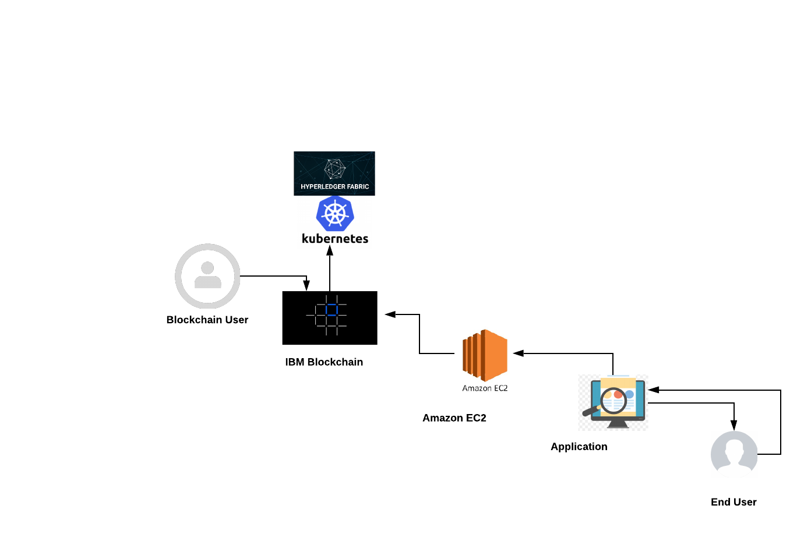
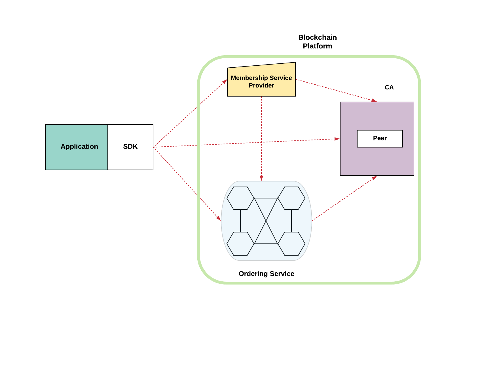

## Produce Tracker

Produce tracker is a multi-cloud fair trade supply network application that increases the visibility and efficiency of goods in the supply chain using iBM Blockchain Platform.

## Abstract

Produce goods distribution has been something that always has some flaws, as the way manufacturers and distributors vary from one place to another. The tracking of these produce goods are managed by many different databases and can easily be manipulated. Our approach would be too instead of storing it in a database is to use a fabric ledger (Blockchain) to track all produce goods. The time and place where it comes from can be secured on a secured platform to ensure the ability to track any good produce purchased by customers incase something to occur when a specific produce good goes through the supply chain. This also can help consumers as when they find an infected product they can go back to the retailer and the retailer can access their systems to track down the day and date when the supply chain started. It also helps knowing and inspecting other transactions to see at the time of shipment of a infected/bad patch you can then observe that some of the products that were shipped in that supply chain could have also been infected.

## Architecture Diagram

## Technology Stack

The application MVP is built on using the IBM Blockchain cloud. Hyperledger Fabric was the choice since it is very integrable with pretty much most use cases and it worked well with us. The Blockchain is then deployed on a Kubernetes cluster as you can see in the below diagram. This blockchain is then integrated with the a web application. For the backend NodeJS and Express were used to make API REST calls to the Blockchain. The calls are done by using a UI which was implemented using React.js, this JavaScript framework is built to accommodate different applications with the ability to use a single page. Other JavaScript libraries also came in handy with front end design. Sass and css were used to improve the overall UI view.

Summary of the technologies:

Front-End: ReactJS, Bootstrap, HTML/Sass.

Back-End: NodeJS, Express, IBM Blockchain Platform, Kubernetes, AWS EC2..

